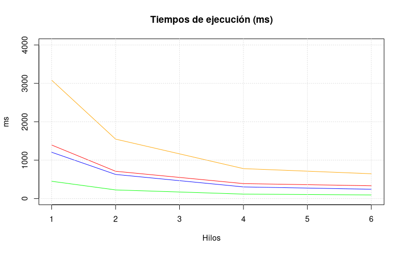
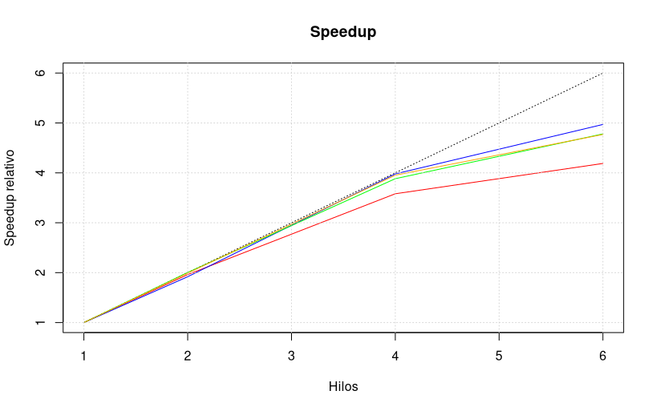
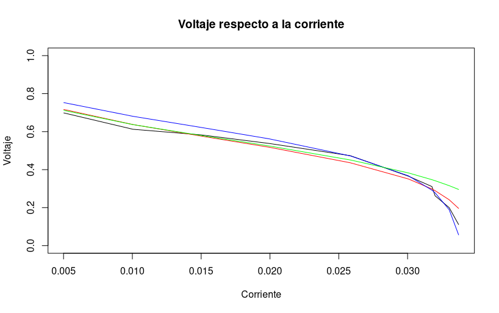

# Optimisaurio
## Optimización de funciones con algoritmos genéticos en paralelo

Por Jesús Ezequiel Ramos Moreno, para el curso de Cómputo Paralelo 2026.
Universidad de Guanajuato - Departamento de Matemáticas

## Descripción
El programa utiliza un algoritmo genético para optimizar funciones $\mathbb{R}^n \to \mathbb{R}$ y paralelización a través del método de islas.

## Algoritmo Genético
El algoritmo genético es un método estocástico para optimizar funciones que imita la Teoría Darwiniana de la evolución.

El algoritmo consiste en una serie de pasos:

1.  Se genera al azar una población inicial dispersa en el dominio de la función

2.  Se eligen los mejores individuos de la población (aquellos con el mejor ajuste). En este caso el ajuste se evalúa mediante un _torneo_: Se eligen al azar $k$ individuos y se comparan entre ellos para elegir al mejor.

3.  Los mejores individuos son cruzados entre ellos para producir nuevas posibles soluciones. En este caso, el cruce se lleva a cabo con la siguiente función: $$c(u,v) = \alpha v + (\alpha - 1)u$$
donde $c(u,v)$ es la nueva potencial solucion, $u,v$ son soluciones seleccionadas mediante un torneo y $\alpha$ es un número aleatorio tal que $ 0 \leq \alpha \leq 1$.

4. Cada vez que se crea una nueva potencial solución, esta tiene una probabilidad de _mutar_. Esto es, aplicar el producto escalar de la potencial solución por un número elegido al azar de una distribución gaussiana de media 0 y desviación estándar 0.1.

5. Se repiten los pasos 2, 3 y 4 hasta el número máximo de iteraciones o una vez que ha pasado cierto número de generaciones sin llegar a una mejor aproximación.

### Método de islas
El método de islas consiste en ejecutar el algoritmo genético en distintos hilos en paralelo, separando las generaciones en épocas (epoch). Al final de cada época, se eligen los mejores individuos de cada isla para "migrar" a las otras islas (efectivamente retransmitiendo su información a los otros hilos). 

#### Ventajas
- Escalabilidad: la escalabilidad del programa es trivial, ya que al agregar un hilo o "isla" más, se mejora directamente la probabilidad de incrementar la precisión de la aproximación.

#### Desventajas
- Para lograr un speedup, se tienen que reducir manualmente el número máximo de generaciones y/o la población.

## Compilar
### Dependencias
- CMake 3.20 o superior
- OpenMPI
### Build
1. Clonar el repositorio
```{bash}
git clone https://github.com/Ezequiel021/optimisaurio.git
cd optimisaurio
```
2. Compilar
```{bash}
cmake -B build
cmake --build build
```

## Ejecutar
### Local
Desde el directorio build:
```{bash}
mpirun -np <numero de procesos> ./opti
```

### Clúster Cimat (SLURM)
Desde el directorio raíz del repositorio:
```{bash}
sbatch slurm
```
### Salida
La salida producirá un archivo out.log que contiene los parámetros óptimos encontrados.

## Pruebas
El programa fue probado localmente con poblaciones de 4000 individuos (1000 por isla) y 6 procesos (islas), así como en el clúster de Cimat con poblaciones de 10000 (100 por isla) y 100 procesos.

### Función senoidal
```
La isla ganadora fue el proceso [5] de 6
Coordenadas del optimo global:
x[0] = -5.04063e-06 (Límites: [-2, 2])
x[1] = -5.48774e-06 (Límites: [-2, 2])
Valor de la funcion = 0.1001117709
Tiempo de ejecución: 236
```
### Función de Michaelwics
```
La isla ganadora fue el proceso [4] de 6
Coordenadas del optimo global:
x[0] = 2.20287 (Límites: [0, 4])
x[1] = 1.57079 (Límites: [0, 4])
Valor de la funcion = -1.801303385
Tiempo de ejecución: 623
```

### Función de Rosenbrock
```
La isla ganadora fue el proceso [5] de 6
Coordenadas del optimo global:
x[0] = 1.00001 (Límites: [0, 4])
x[1] = 1.00001 (Límites: [0, 4])
Valor de la funcion = 4.819189912e-10
Tiempo de ejecución: 93
```

### Función Six-hum camel back
```
La isla ganadora fue el proceso [4] de 6
Coordenadas del optimo global:
x[0] = 0.0898533 (Límites: [-3, 3])
x[1] = -0.712653 (Límites: [-2, 2])
Valor de la funcion = -1.031628365
Tiempo de ejecución: 326
```
### Tiempo de ejecución
|Color| Función de error optimizada|
|---|---|
|Negro| Datos experimentales |
|Rojo | Six-hum camel back |
|Azul | Sinoidal |
|Verde | Rosenbrock |
|Naranja | Michaelwicz|



### Speedup relativo



### Función de error
|Color| Función de error optimizada|
|---|---|
|Negro| Datos experimentales |
|Rojo | SSE |
|Azul | SAE |
|Verde | MAE|

